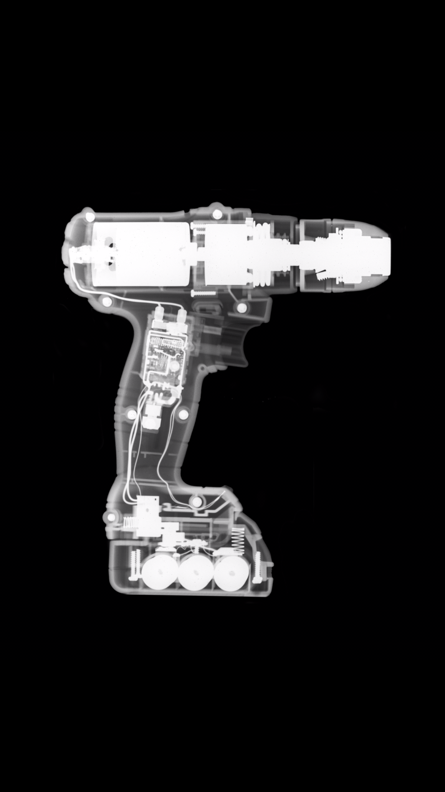
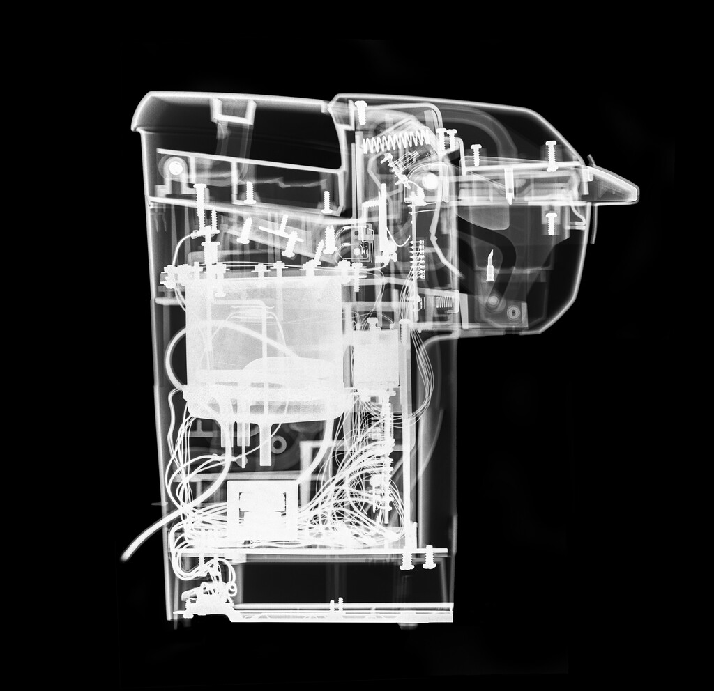

# xray-controller

This repository contains a collection of scripts used to coordinate
image capture on my home-built X-ray imager. Code for two approaches
are included, one based on control through a 433 MHz transmitter and
the other through WiFi to a Sonoff smart relay. The latter was the
most recently used approach. I was relatively new to programming when
writing this code, and as such this many things are not cleanly
implemented. I presently live in an apartment which makes the testing
of X-ray devices prohibitive. I hope to resume this project one day
and polish this repository into a ready to use X-ray controller.

Below are some example images. Also included below is an attempt at
imaging a Rubik's cube through computed tomography. The animation
traverses slices from top to bottom, finally passing through a solid
cylindrical stand that the Rubiks' cube was sitting on. Capture of
CT images proved difficult as it requires a means of precisely
rotating the target and involves the capture of nearly 100 images.

|    |   |
| ------------- | ------------- |
| | |
| | |

## Image Capture

Image capture is done using a scintillator and a DSLR. The
scintillator was extracted from an X-ray film cassette and glows in
visible wavelengths when exposed to X-rays. Scintillators come with
varying crystal sizes, with larger crystals having greater luminous
output and thus lower exposure times at the expense of decreased
resolution. A typical exposure would be something like 3 seconds,
F2.8, 4000 ISO. All images were capture on a Nikon D7100. With modern
DSLRs a higher ISO is likely to produce clean results.

Images are postprocessed by hand to give photographically appealing
results. One key postprocessing step is the median merging of multiple
exposures. X-rays can interact with the DSLR sensor directly to
produce hot pixels. These hot pixels are sparse and randomly
distributed, so by using a median of multiple exposures these hot
pixels are eliminated from the final result.

Capture of objects larger than the area covered by the scintillator is
done by photographing individual sections of the object and
stitching those sections together into a final product.
